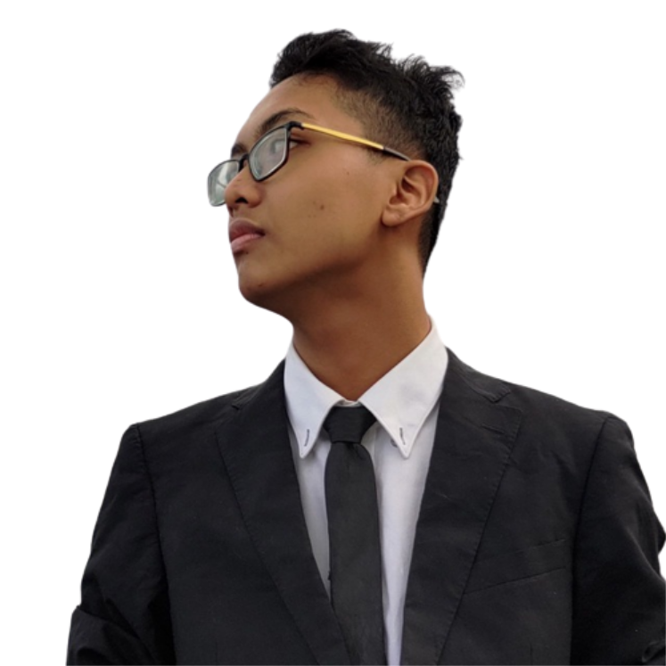

  

<h1 align="center">Muhammad Alif Daniel</h1>

  Developer from Malaysia focused on frontend craft, scalable UI systems, and practical fullstack product work.

  
  
  
  
  

## About Me

I enjoy turning ideas into polished web experiences that feel fast, clear, and maintainable. My work usually sits between frontend craft and practical product delivery: building interfaces, designing reusable UI systems, integrating APIs, improving developer experience, and cleaning up messy systems so they are easier to extend.

I care a lot about performance, strong TypeScript foundations, scalable component patterns, and migrations that make legacy platforms better instead of just newer.

## What I Focus On

| Area | What that means in practice |
| --- | --- |
| Frontend and fullstack product work | Building modern React and Next.js experiences that are production-ready and easy to maintain |
| Reusable UI systems | Creating component patterns and design-to-code workflows that speed up delivery without losing consistency |
| Legacy modernization | Migrating older systems into cleaner and faster stacks while protecting important product flows |
| Performance and maintainability | Improving load time, reducing technical debt, and making day-to-day development smoother |

## Stack I Work With

  
  
  
  
  
  
  
  
  

## Experience Snapshot

| Role | Period | Highlights |
| --- | --- | --- |
| Fullstack Web Developer, Lapasar Sdn Bhd | Jun 2024 - Mar 2026 | Migrated a legacy CodeIgniter system to React with Vite, improved maintainability, and refined marketplace and dashboard flows |
| Frontend Web Developer Intern, AllMeans Pte. Ltd. | Aug 2023 - Feb 2024 | Built an admin management system, translated Figma into reusable components, and integrated frontend flows with backend APIs |
| Service Crew, Pizza Hut | 2022 | Built discipline, teamwork, communication, and consistency in a fast-paced environment |

## How I Like To Build

I like products that feel intentional: fast loading, visually sharp, clearly structured, and easy to extend. I am especially interested in frontend architecture, reusable systems, developer tooling, and product work where both code quality and user experience matter.

## Current Direction

Right now I am focused on growing as a fullstack developer with a strong frontend foundation. The work I enjoy most lives around system design, UI quality, performance, migrations, and production features that need to stay maintainable over time.

## Contact

- Website: https://alifdaniel.dpdns.org
- GitHub: https://github.com/ALXP-DANIEL
- LinkedIn: https://linkedin.com/in/thealifhaker1
- Instagram: https://instagram.com/thealifhaker1
- Email: alifdaniel.personalspace@gmail.com
