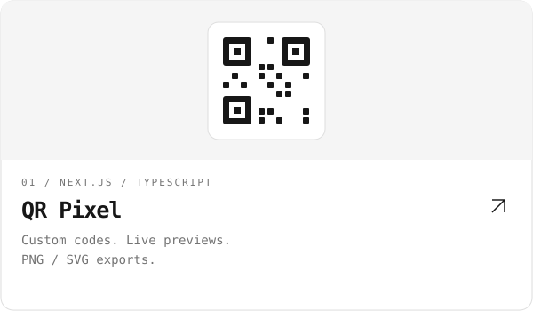
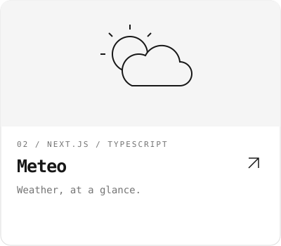
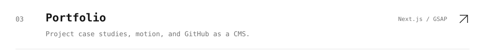
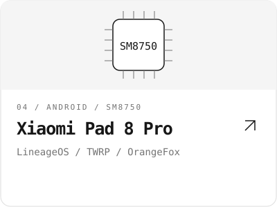

<picture><source media="(prefers-color-scheme: dark)" srcset="./assets/work-header-dark.svg" /><source media="(prefers-color-scheme: light)" srcset="./assets/work-header-light.svg" /></picture>

<table>
<tr>
<td width="60%" valign="top"><a href="https://github.com/ALXP-DANIEL/QR-PIXEL"><picture><source media="(prefers-color-scheme: dark)" srcset="./assets/qr-pixel-dark.svg" /><source media="(prefers-color-scheme: light)" srcset="./assets/qr-pixel-light.svg" /></picture></a></td>
<td width="40%" valign="top"><a href="https://github.com/ALXP-DANIEL/METEO"><picture><source media="(prefers-color-scheme: dark)" srcset="./assets/meteo-dark.svg" /><source media="(prefers-color-scheme: light)" srcset="./assets/meteo-light.svg" /></picture></a></td>
</tr>
<tr>
<td width="60%" valign="top"><a href="https://github.com/ALXP-DANIEL/PORTFOLIO"><picture><source media="(prefers-color-scheme: dark)" srcset="./assets/portfolio-dark.svg" /><source media="(prefers-color-scheme: light)" srcset="./assets/portfolio-light.svg" /></picture></a></td>
<td width="40%" valign="top"><a href="https://github.com/ALXP-DANIEL/ANDROID_DEVICE_XIAOMI_PIANO"><picture><source media="(prefers-color-scheme: dark)" srcset="./assets/piano-dark.svg" /><source media="(prefers-color-scheme: light)" srcset="./assets/piano-light.svg" /></picture></a></td>
</tr>
</table>

 

`OFF THE CLOCK` — Self-hosted services, deployment experiments, and learning how to bring things back when they break.

[More work & case studies ↗](https://alifdaniel.dpdns.org/work)
