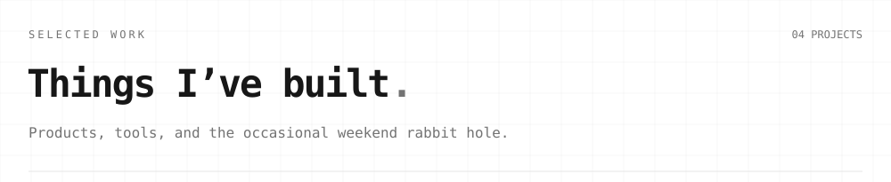
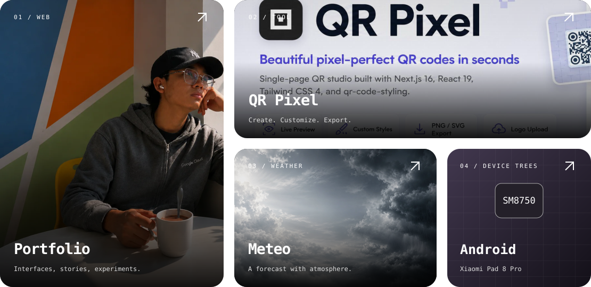
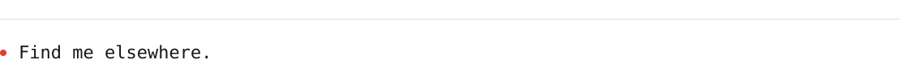

<picture><source media="(prefers-color-scheme: dark)" srcset="./assets/work-header-dark.svg" /><source media="(prefers-color-scheme: light)" srcset="./assets/work-header-light.svg" /></picture>

<picture><source media="(prefers-color-scheme: dark)" srcset="./assets/social-header-dark.svg" /><source media="(prefers-color-scheme: light)" srcset="./assets/social-header-light.svg" /></picture>

<a href="https://alifdaniel.dpdns.org"><picture><source media="(prefers-color-scheme: dark)" srcset="./assets/social-website-dark.svg" /><source media="(prefers-color-scheme: light)" srcset="./assets/social-website-light.svg" /></picture></a>
<a href="https://github.com/ALXP-DANIEL"><picture><source media="(prefers-color-scheme: dark)" srcset="./assets/social-github-dark.svg" /><source media="(prefers-color-scheme: light)" srcset="./assets/social-github-light.svg" /></picture></a>
<a href="https://www.linkedin.com/in/thealifhaker1/"><picture><source media="(prefers-color-scheme: dark)" srcset="./assets/social-linkedin-dark.svg" /><source media="(prefers-color-scheme: light)" srcset="./assets/social-linkedin-light.svg" /></picture></a>
<a href="https://www.instagram.com/thealifhaker1/"><picture><source media="(prefers-color-scheme: dark)" srcset="./assets/social-instagram-dark.svg" /><source media="(prefers-color-scheme: light)" srcset="./assets/social-instagram-light.svg" /></picture></a>
<a href="https://x.com/thealifhaker1"><picture><source media="(prefers-color-scheme: dark)" srcset="./assets/social-x-dark.svg" /><source media="(prefers-color-scheme: light)" srcset="./assets/social-x-light.svg" /></picture></a>
<a href="mailto:alifdaniel.workspace@gmail.com"><picture><source media="(prefers-color-scheme: dark)" srcset="./assets/social-email-dark.svg" /><source media="(prefers-color-scheme: light)" srcset="./assets/social-email-light.svg" /></picture></a>

