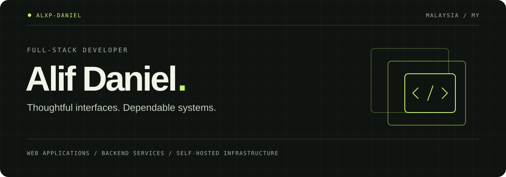

  <a href="https://alifdaniel.dpdns.org">Portfolio</a> &nbsp; / &nbsp;
  <a href="https://www.linkedin.com/in/thealifhaker1/">LinkedIn</a> &nbsp; / &nbsp;
  <a href="mailto:alifdaniel.workspace@gmail.com">Email</a>

 

### Behind the code

I'm **Muhammad Alif Daniel**, a full-stack web developer based in **Malaysia**. I turn real-world requirements into practical web applications, with an eye for thoughtful interfaces and clean architecture.

My work spans frontend experiences, backend services, and the undocumented legacy systems that need a little patience to untangle. Away from work, I run a self-hosted homelab to get hands-on with deployments, backups, and service recovery.

 

### Selected work

| Project | What I’m building |
| :--- | :--- |
| **[QR Pixel](https://github.com/ALXP-DANIEL/QR-PIXEL)** | A QR studio with live previews, custom styling, logo uploads, and PNG / SVG exports. |
| **[Meteo](https://github.com/ALXP-DANIEL/METEO)** | A weather application built with Next.js, TypeScript, and shadcn/ui. |
| **[Portfolio](https://github.com/ALXP-DANIEL/PORTFOLIO)** | My corner of the web: project case studies powered by GitHub, a command palette, and interactive motion. |
| **[Xiaomi Pad 8 Pro](https://github.com/ALXP-DANIEL/ANDROID_DEVICE_XIAOMI_PIANO)** | Android device trees for LineageOS, TWRP, and OrangeFox on the SM8750 platform. |

 

### Tools of the trade

| Area | Tools |
| :--- | :--- |
| Interfaces | TypeScript · React · Next.js · Vue.js · Tailwind CSS |
| Services | C# · ASP.NET Core · PHP · Laravel · Node.js · NestJS |
| Data | PostgreSQL · SQL Server · MySQL · Prisma |
| Shipping | Docker · Docker Compose · GitHub Actions · Vercel |
| Quality | Playwright · Vitest · API testing |

 

### Beyond the browser

My homelab is where I explore the infrastructure behind the software: private photo backups with Immich, home automation, DNS filtering, VPN access, and Docker services behind a reverse proxy.

Building it, breaking it, and bringing it back teaches me something a tutorial rarely does.

---

  <strong>Have something in mind?</strong> 
  <a href="mailto:alifdaniel.workspace@gmail.com">Let’s talk</a> · <a href="https://alifdaniel.dpdns.org/work">Explore my work</a>

