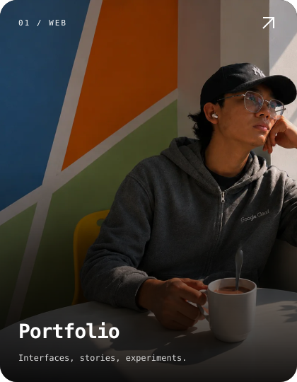
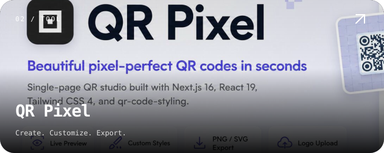
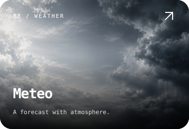
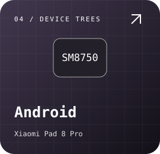

<picture><source media="(prefers-color-scheme: dark)" srcset="./assets/work-header-dark.svg" /><source media="(prefers-color-scheme: light)" srcset="./assets/work-header-light.svg" /></picture>

<table>
<tr>
<td rowspan="2" width="40%"></td>
<td colspan="2" width="60%"></td>
</tr>
<tr>
<td width="35%"></td>
<td width="25%"></td>
</tr>
</table>

[Explore the work ↗](https://alifdaniel.dpdns.org/work)
